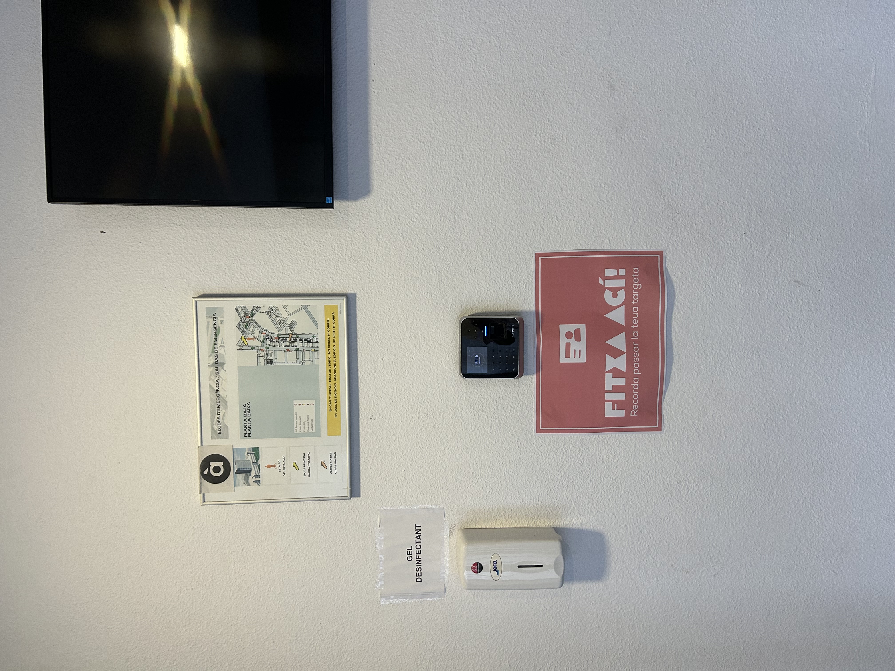
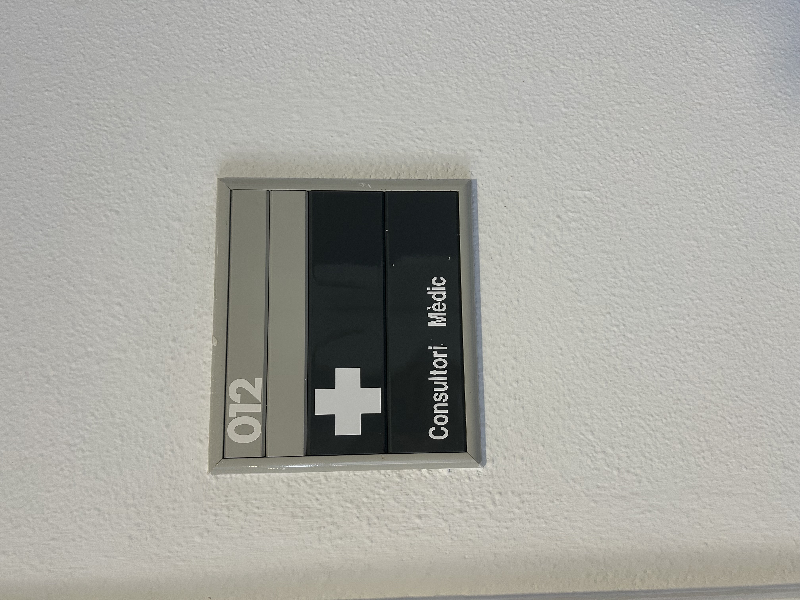
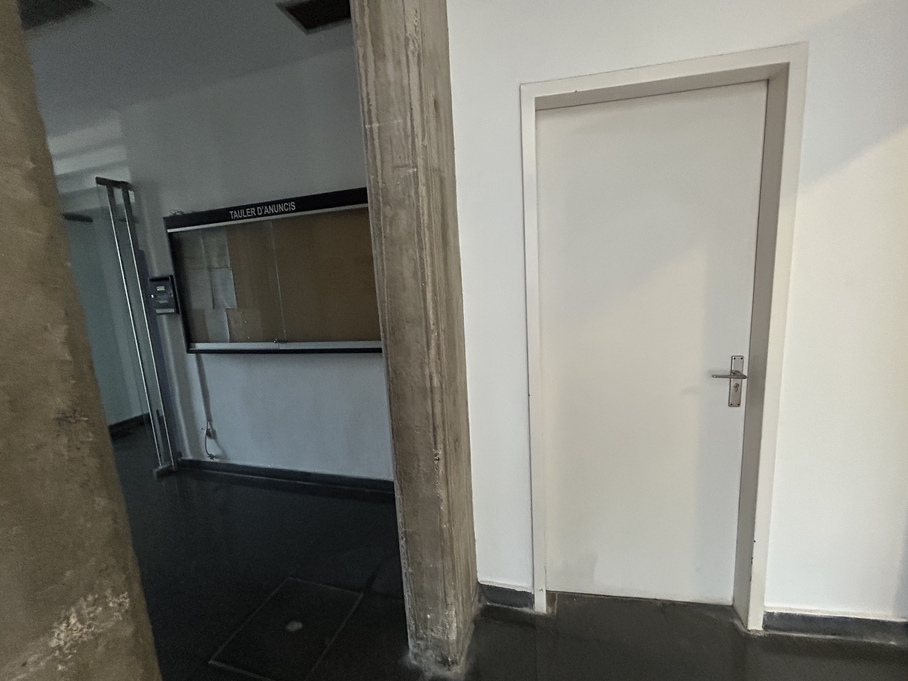
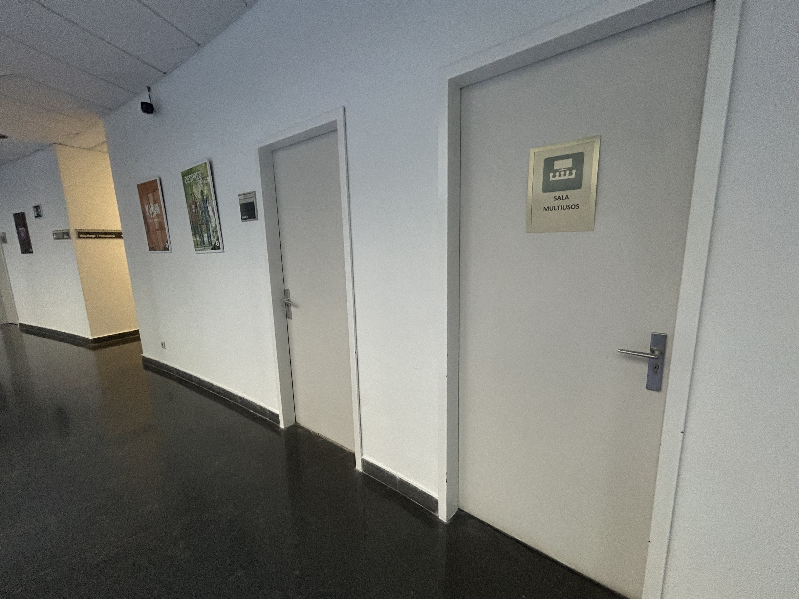
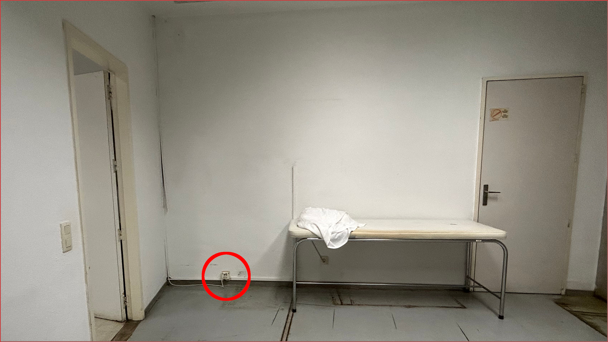
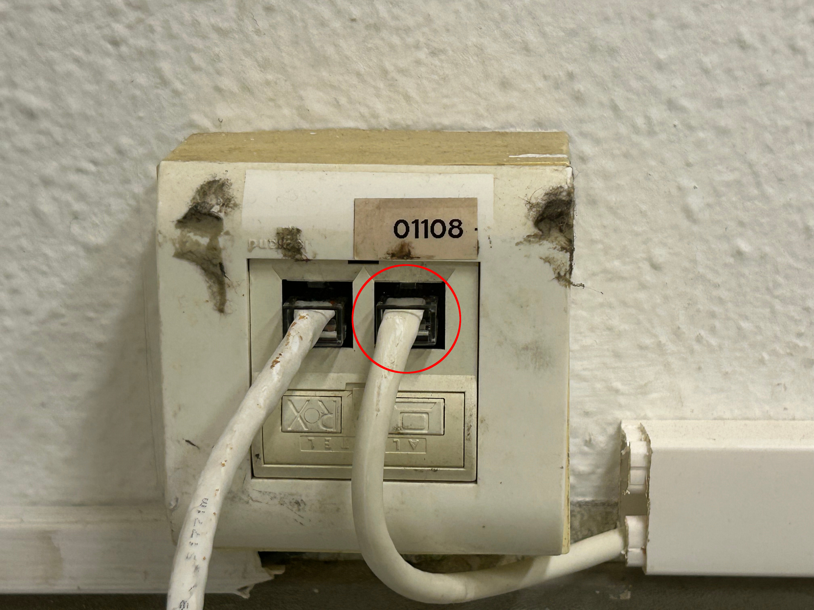
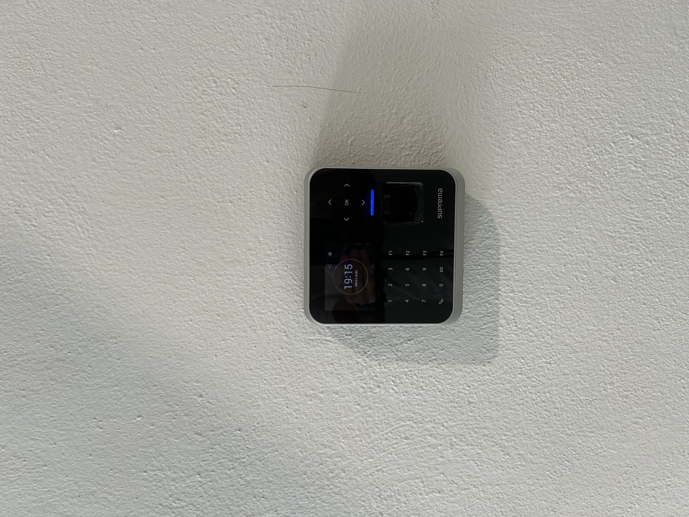
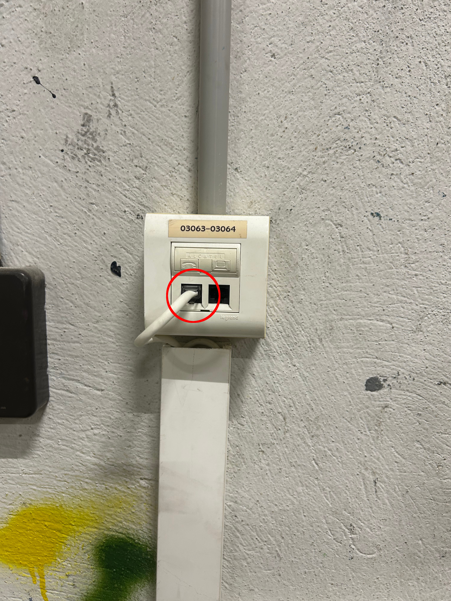
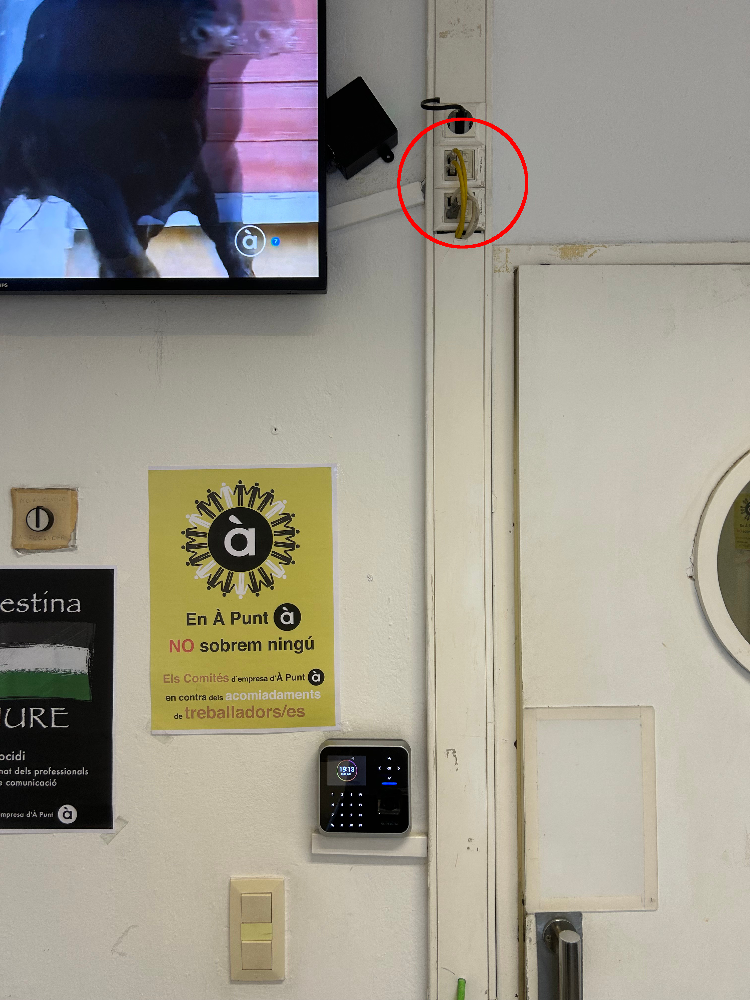
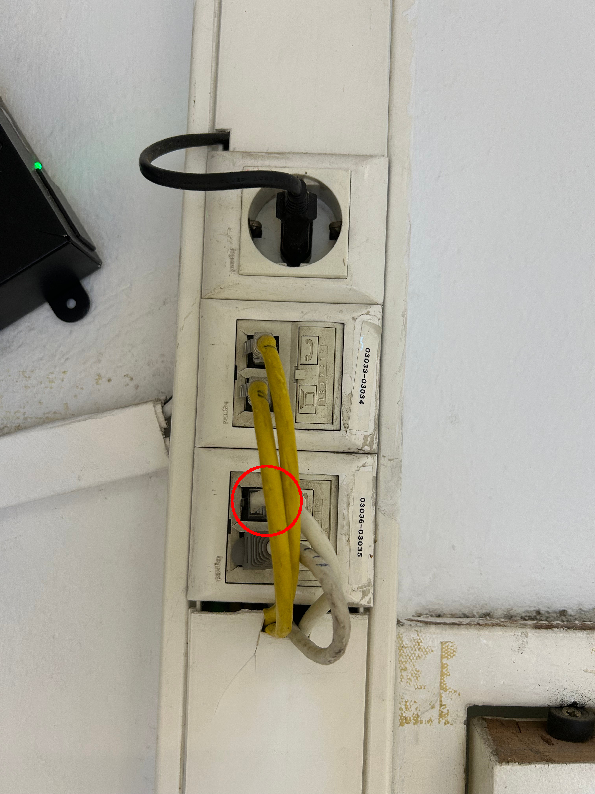

# Reinicio de Lectores de presencia:

#### Existen tres entradas de personal actualmente

1. Entrada de Ascensores

2. Entrada de Estudios

3. Entrada de kiosco.

Todas ellas estan conectadas por cable UTP con poe y datos, para reiniciar los lectores solo hay que desconectar su cable UTP unos segundos (30s aproximadamente) y volver a conectar. El tiempo de reinicio viene a ser de un minuto.

Para acometer dichas desconexiones hay acceso directo para la entrada del kiosco, la llave de acceso a la de la entrada de estudios pero para reiniciar el lector de la entrada de ascensores se debe solicitar acceso a la sala 012.

---

### Entrada de ascensores.

Esta es la única entrada a la que se debe solicitar acceso a seguridad Existen tres puertas por las que se puede acceder a la base de conexión del lector

---

###### Lector Entrada de Ascensores

#### Accesos a la roseta de conexión:

- Puerta de Consulta Médica:
  
  

- Puerta Sala de Curas s/n, frente ascensores:
  
  

- Puerta trasera, Sala Multiusos:
  
  

#### Roseta de conexión:

Ubicación de la roseta en la sala contigua a la Consulta Médica (012) o Sala Multiusos

Detalle del cable a desconectar

---

### Entrada de Estudios

Para acceder a la roseta de conexión es necesaria la llave del Almacén de cámaras está al lado izquierdo mirando hacia fuera de la puerta.

El único cable conectado corresponde al lector de presencia de la entrada de estudios.

---

### Entrada de Kiosco:

La roseta esta justo encima del lector

